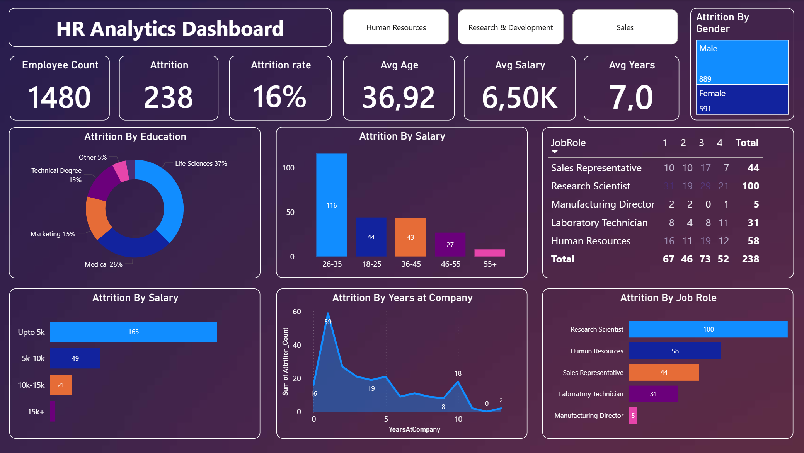
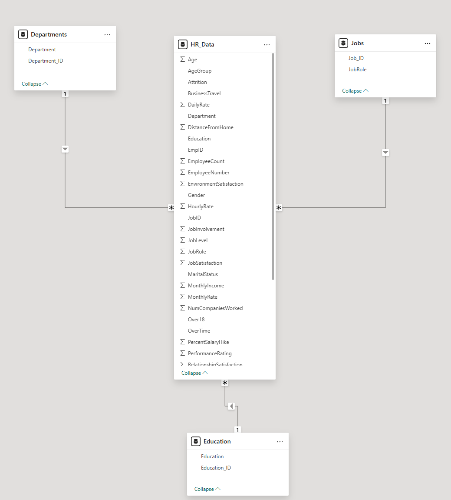
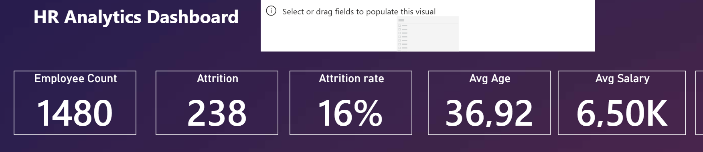

# HR Analytics Dashboard – Employee Attrition Analysis

## 📋 Project Overview

In this project, I **developed** a comprehensive HR analytics solution to uncover the underlying causes of employee turnover. Starting from a raw dataset (Excel), I **built** an interactive Power BI dashboard through data cleaning and modeling to effectively support HR management in their decision-making process.

## 🎯 Project Goals

My primary goal was to identify which employee segments are most at risk of leaving and to determine which factors (e.g., salary, job role, age, satisfaction) correlate most strongly with attrition.

## 🛠 Project Workflow

1.  **Data Acquisition & Preparation:** I **processed** a relational database consisting of multiple tables (HR Data, Job Roles, Departments, and Education).
2.  **Data Cleaning (Power Query):** I **configured** and **standardized** appropriate data types, **handled** missing values for more precise segmentation.

3.  **Data Modeling:** I **established** a Star Schema between the fact table (`HR_Data`) and the dimension tables (`Departments`, `Jobs`, `Education`):

4.  **DAX Measures:** I **wrote** custom calculations to extract Key Performance Indicators (KPIs). For example:

5.  **Visualization:** I **designed and implemented** an interactive dashboard that visually separates demographic and professional metrics for intuitive analysis. A picture about the process:

## 

## ❓ Business Questions Answered

Throughout my analysis, I **sought and provided answers** to the following questions:

- What is the current employee attrition rate?
- Which age groups and genders are most prone to leaving?
- In which job roles is attrition the highest?
- How does salary level impact employee retention?
- Is there a correlation between educational background and the likelihood of resigning?

---

## 📊 Key Findings & Insights

Based on the dashboard data, I **drew** the following conclusions:

### 1. General Metrics

- **Total Employees:** 1480
- **Attrition:** 238 employees (resulting in a **16.1% attrition rate**).
- **Average Age:** 37 years.

### 2. Demographic Trends

- I **observed** that the **26-35 age group** shows the highest turnover (116 people).
- The data indicates that the attrition rate is higher among male employees.

### 3. Job Roles & Salary

### 3. Job Roles (Critical Areas)

- I **identified** that the most critical areas for turnover are:
  - **Research Scientist:** 100 employees
  - **Human Resources:** 58 employees
  - **Sales Representative:** 44 employees
- These roles require immediate attention due to their high volume of departures.

---

## 💡 Recommendations for Management

Based on the results of my analysis, I **recommend** the following steps:

1.  **Job-Specific Retention Strategy:** Review the workload and career growth opportunities for _Research Scientists_ and _HR_ staff, as these roles show the highest attrition.
2.  **Retention Program for Young Talent:** Implement targeted career path planning specifically for the 26-35 age group.
3.  **Salary Benchmarking:** Conduct a market-based salary review for roles in the lowest pay brackets to ensure competitive compensation.

---

## 💻 Tech Stack

- **Data Source:** Excel / CSV
- **Tool:** Power BI Desktop
- **Query Language:** DAX (Data Analysis Expressions)
- **Data Transformation:** Power Query
